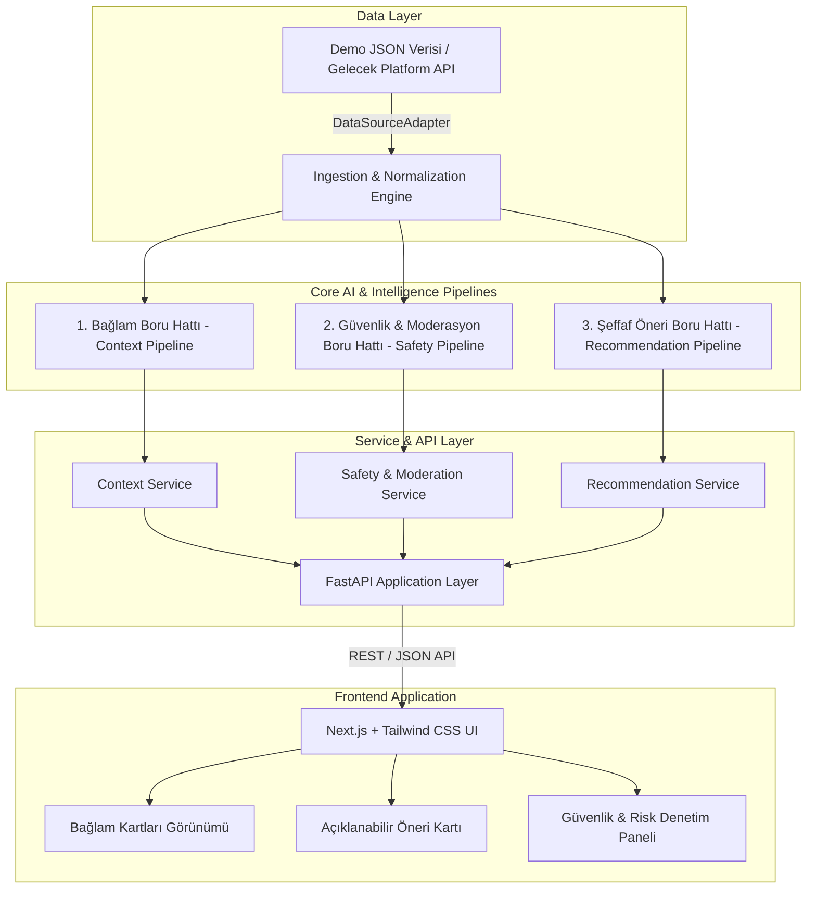
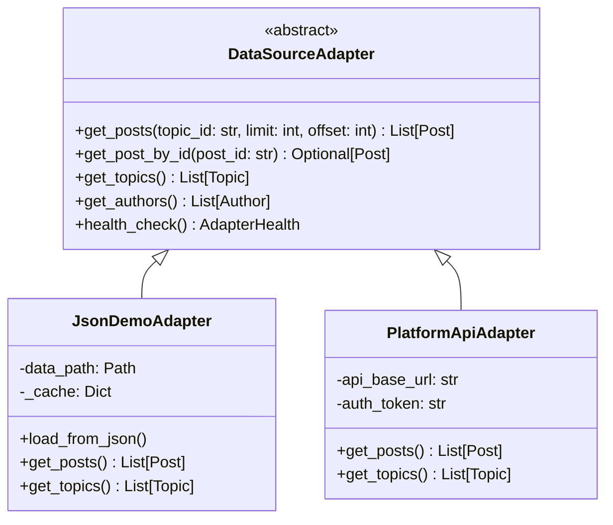

# NSosyal Pusula - Sistem ve Yazılım Mimarisi (Architecture Specification)

Bu doküman, **NSosyal Pusula: Yapay Zekâ Destekli Bağlam ve Şeffaf Öneri Sistemi** projesinin katmanlı mimarisini, veri akış boru hatlarını (pipelines), veri adaptör soyutlamasını ve matematiksel/sezgisel karar modellerini tanımlar.

---

## 1. Yüksek Seviye Sistem Mimarisi (High-Level Architecture)



---

## 2. Veri Adaptör Katmanı (`DataSourceAdapter`)

Platformun en kritik mimari prensiplerinden biri, veri kaynağı bağımsızlığıdır. Sistem hiçbir zaman doğrudan sabit bir API veya statik veri dosyasına kilitlenmez. Tüm veri çekme işlemleri `DataSourceAdapter` soyut sınıfı üzerinden gerçekleştirilir.



### Adaptörün Sağladığı Avantajlar:
1. **Faz 1 Desteği:** `JsonDemoAdapter` yerel `data/demo_posts.json` dosyasını okuyarak hiçbir dış bağımlılık olmadan çalışır.
2. **Gelecek Faz Desteği:** `PlatformApiAdapter` devreye alındığında iş mantığında, modellerde veya arayüzde hiçbir değişiklik yapılmasına gerek kalmaz.

---

## 3. Temel Boru Hatları (Core Pipelines)

### 3.1. Bağlam Boru Hattı (Context Pipeline)

Bağlam Kartları, parçalı paylaşımları anlamsal olarak gruplayarak kullanıcılara dengeli bir genel bakış, tarafların argümanları ve zaman çizelgesi sunar.

```
[Post Ingestion]
      ↓
[Metin Ön İşleme & Normalizasyon] (Türkçe stop-words, lemmatization, temizlik)
      ↓
[Anlamsal Gömme / Embeddings] (Sentence Transformer / multilingual-e5)
      ↓
[Anlamsal Kümeleme / Semantic Clustering] (HDBSCAN / Cosine Similarity / KMeans)
      ↓
[Konu ve Alt Tema Temsili] (KeyBERT / TF-IDF / LLM Topic Extraction)
      ↓
[Çoklu Perspektif & Zaman Çizelgesi Sentezi] (Destekleyen / Eleştiren / Doğrulayıcı Görüşler)
      ↓
[Bağlam Kartı / Context Card]
```

#### Bağlam Kartı Veri Modeli (Context Card Schema)
* **`id` & `topic_id`:** Konu ve kart tanımlayıcısı.
* **`title` & `summary`:** Konunun tarafsız ve anlaşılır özeti.
* **`key_themes`:** Öne çıkan alt temalar / anahtar kelimeler.
* **`perspectives`:** Farklı görüş grupları (Destekleyenler, Eleştirenler, Nötr Bilgiler).
* **`timeline`:** Olayların kronolojik gelişimi.
* **`sources`:** Atıfta bulunulan kaynaklar ve güvenilirlik puanları.
* **`participant_count` & `post_count`:** Tartışmaya katılan kişi ve gönderi sayısı.

---

### 3.2. İçerik Güvenliği ve Moderasyon Boru Hattı (Safety Pipeline)

İçerik güvenliği boru hattı, paylaşımların zararlı veya manipülatif olma ihtimalini kategorik etiketleme yapmadan, açıklanabilir risk vektörleri ile puanlar.

```
[Paylaşım / Post]
      ↓
┌─────────────────────────────────────────────────────────────┐
│ Eş Zamanlı Analiz Katmanları                                │
│                                                             │
│ 1. Spam & Format Sezgiselleri (Bağlantı yoğunluğu, büyük    │
│    harf oranı, anlamsız karakter tekrarları)                │
│ 2. Tekrar Analizi (Exact duplicate, Jaccard / Levenshtein)  │
│ 3. Koordinasyon & Bot Sinyalleri (Zaman aralığı, şablon     │
│    benzerliği, kullanıcı yayılım hızı)                      │
│ 4. Toksisite & Nefret Dili Sınıflandırıcısı (Kural & AI)    │
└─────────────────────────────────────────────────────────────┘
      ↓
[Normalleştirilmiş Güvenlik Risk Vektörü (Normalized Risk Vector)]
      ↓
[İnsan Denetimine Uyumlu Karar & Moderasyon Bayrakları]
```

#### Güvenlik Risk Vektörü Bileşenleri:
* $S_{spam} \in [0, 1]$: Spam ve format anomalisi skoru.
* $S_{repetition} \in [0, 1]$: Metin tekrarı ve şablon benzerliği skoru.
* $S_{coordination} \in [0, 1]$: Koordineli bot faaliyeti şüphesi skoru.
* $S_{toxicity} \in [0, 1]$: Toksik/hakaret dili ihtimal skoru.
* $S_{hate\_speech} \in [0, 1]$: Nefret söylemi ve ayrımcılık ihtimal skoru.
* **Genel Risk Düzeyi:** `LOW` (0.0 - 0.3), `MEDIUM` (0.3 - 0.7), `HIGH` (0.7 - 1.0).

---

### 3.3. Şeffaf Öneri Boru Hattı (Recommendation Pipeline)

Öneri boru hattı, kullanıcının feed'inde yer alacak gönderilerin sıralamasını şeffaf, denetlenebilir ve kullanıcıya açıklanabilir bir matematiksel formülle belirler.

```
[Kullanıcı Profil Tercihleri & İlgi Alanları] + [Aday Paylaşımlar Havuzu]
      ↓
┌─────────────────────────────────────────────────────────────┐
│ Pozitif Çarpanlar                                           │
│  + w₁ * Anlamsal İlgi Benzerliği (Semantic Similarity)      │
│  + w₂ * Konu Yakınlığı (Topic Affinity)                     │
│  + w₃ * Güncellik Skoru (Recency Decay)                     │
│  + w₄ * Çeşitlilik & Keşif Skoru (Diversity Boost)          │
│                                                             │
│ Negatif Çarpanlar (Cezalar)                                 │
│  - w₅ * Tekrar Eden İçerik Cezası (Repetition Penalty)      │
│  - w₆ * Güvenlik Riski Cezası (Safety Risk Penalty)         │
└─────────────────────────────────────────────────────────────┘
      ↓
[Nihai Tavsiye Skoru & Normalize Sıralama]
      ↓
[Doğal Dilde "Neden Bunu Görüyorum?" Açıklama Üretimi]
```

#### Öneri Puanlama Formülü:
$$\text{Score}(u, p) = \max\left(0, \; w_1 \cdot \text{sim}(u, p) + w_2 \cdot \text{aff}(u, p) + w_3 \cdot \text{rec}(p) + w_4 \cdot \text{div}(p) - w_5 \cdot \text{rep}(p) - w_6 \cdot \text{risk}(p)\right)$$

Burada her bileşen `[0.0, 1.0]` aralığına normalize edilmiş olup; kullanıcı arayüzünde her bir faktörün öneriye olan katkısı yüzde çubukları ve açıklama metni olarak sunulur.

---

## 4. REST API Uç Noktaları Spesifikasyonu

| Metot | Uç Nokta | Açıklama |
| :--- | :--- | :--- |
| `GET` | `/health` | Servis sağlık durumu, aktif adaptör ve sürüm bilgisi |
| `GET` | `/api/posts` | Gönderi akışı listesi (konu filtresi, sayfalama) |
| `GET` | `/api/topics` | Sistemdeki güncel konular ve katılım istatistikleri |
| `GET` | `/api/context/{topic_id}` | İlgili konuya ait Bağlam Kartı (özet, perspektifler, timeline) |
| `POST` | `/api/safety/analyze` | Gönderilen metnin canlı spam, tekrar ve toksisite analizi |
| `GET` | `/api/recommendations` | Şeffaf skorları ve açıklamalarıyla önerilen gönderi akışı |

---

## 5. Teknoloji Yığını ve Kütüphane Seçimleri

* **Backend:** Python 3.10+, FastAPI (Asenkron REST), Pydantic v2 (Tip doğrulaması ve şema tanımı), Uvicorn.
* **Frontend:** Next.js (App Router), TypeScript, Tailwind CSS, Lucide Icons.
* **Test & Kalite:** Pytest, HTTPX TestClient, MyPy/Ruff standartlarına uyumlu tip tanımları.
